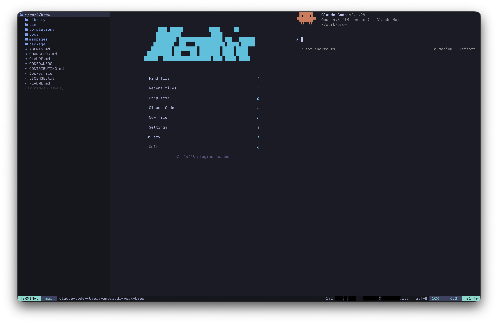
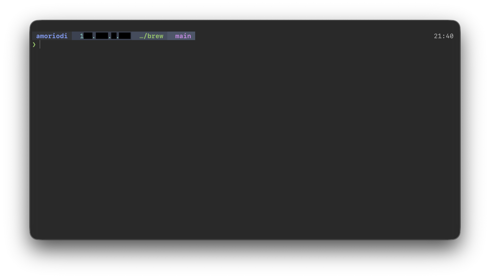

<div align="center">

# ⋆ dotfiles ⋆

a macOS development environment




`ghostty` · `zsh` · `starship` · `neovim` · `claude code`

</div>

<br>

<table>
<tr>
<td valign="top" width="33%">

###### shell

starship prompt
live ip · git · runtime · clock

zoxide smart cd
autosuggestions
syntax highlighting

eza · bat · fd · ripgrep

</td>
<td valign="top" width="33%">

###### neovim

kickstart.nvim
lsp · treesitter · telescope

lualine · nvim-navic
neo-tree

claude code sidebar

noice · notify · alpha

</td>
<td valign="top" width="33%">

###### ghostty

moonfly theme
liga sfmono nerd font

translucent with blur

custom splits & tabs
quick terminal

</td>
</tr>
</table>

<br>

###### install

```bash
git clone https://github.com/Doldrums/dotfiles.git ~/dotfiles
cd ~/dotfiles && ./install.sh
```

###### structure

```
zsh/        shell config
starship/   prompt
ghostty/    terminal + moonfly theme
nvim/       kickstart custom plugins
```

<br>

<div align="center">

⋆

</div>
